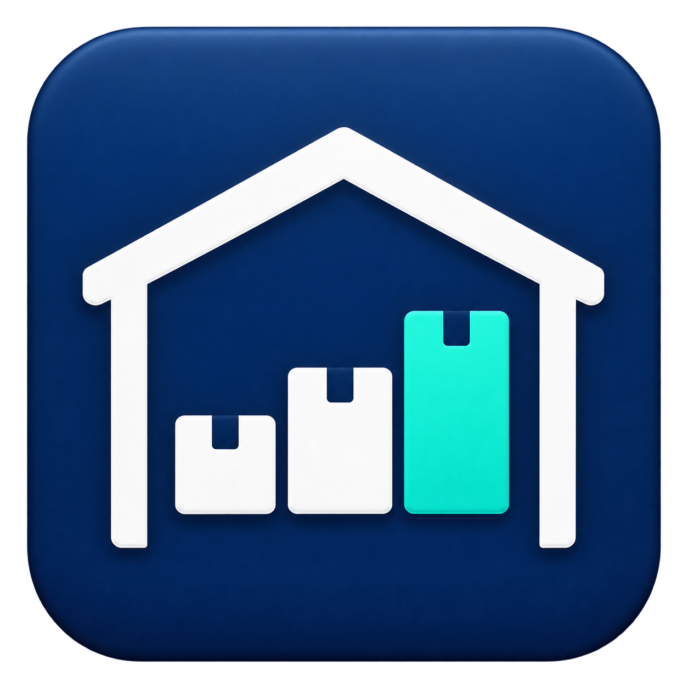

<p align="center"></p>

# Warehouse Dashboard

See warehouse occupancy, understand inventory, and review changes over time. Warehouse Dashboard is a Windows desktop app with configurable warehouse profiles and local or shared-folder storage.

## Get started

1. Download the Windows installer from [Releases](https://github.com/HendyGH/warehouse-density-dashboard/releases). Development installers are also available in successful [build runs](https://github.com/HendyGH/warehouse-density-dashboard/actions).
2. Install and open **Warehouse Dashboard**. Node.js and Rust are not needed to use the app.
3. Choose **On this computer**, **Create a shared warehouse**, or **Join an existing warehouse**. Use the suggested local folder or browse to your warehouse folder.
4. For a new warehouse, choose **Use accounts** or **Continue without accounts**.
5. Name the warehouse and choose a **General** or **Electronics** template.
6. Paste spreadsheet cells into **Import assistant**, match columns, and preview before applying. Sample data and **Skip for now** are available.

The installer may need internet access to install Microsoft WebView2 if it is missing. After installation, normal work runs without internet; shared warehouses still need access to their network folder.

## Access modes

| Mode | Behavior |
| --- | --- |
| **Without accounts** | Opens directly. Anyone with access to the warehouse folder can edit data. Activity is not attributed to individual people. |
| **With accounts** | Create the first administrator, then sign in. Administrators manage accounts, editors update data, and viewers review it. |
| **Join existing** | Keeps the warehouse's existing accounts, access mode, and shared profile. |

Access mode is chosen when creating a warehouse. Existing account-based warehouses continue to require sign-in after an upgrade.

## Features and templates

- Density views by zone and bin, inventory search, and item details.
- Snapshots and comparisons over time.
- Configurable categories, receiving locations, and warehouse rules.
- Optional segregation checks, putaway suggestions, and operational modules.

**General** starts with density and snapshots. **Electronics** includes raw material, battery and packing categories, receiving, and electronics rules. New profiles are saved in the warehouse folder so other computers joining it load the same configuration.

## Import your spreadsheet

Copy **tab-separated cells with a header row**. Custom and non-English headers are supported. Every column needs a unique, non-empty header.

- **Bin master:** bin and pallet count. Category and bin category are optional.
- **Detailed stock, optional:** part number, category, quantity, and bin. Description, batch, and handling unit can be **Not used**.
- **Category quantities, optional:** map these when using segregation rules.

The preview shows totals and the first five bins. Applying replaces the current inputs and saves the column mappings. Existing snapshots remain available. Input persistence follows the app's auto-save setting.

See the [profile guide](docs/warehouse-profile-v1.md) for advanced rules and mappings.

## Shared folders and backups

Every computer must choose the same readable and writable warehouse folder. Use a network path or mapped drive. Coordinate shared edits: file storage does not provide a database server's concurrent-edit guarantees.

Back up the entire warehouse folder, including accounts, settings, profiles and operational data. Preferences remain on each computer. See [Upgrading and recovery](docs/upgrading.md).

## Troubleshooting

| Problem | Next step |
| --- | --- |
| Folder cannot be opened | Check network connectivity and folder read/write access. |
| Warehouse already exists | Choose **Join an existing warehouse**. |
| Columns do not match | Include headers and check the selections in Import assistant. |
| Invalid preview rows | Correct missing bins, quantities or column matches. |
| Damaged accounts or settings | Restore a trusted backup; do not delete accounts to bypass sign-in. |

**About** shows the version, warehouse and access mode. Report problems in [Issues](https://github.com/HendyGH/warehouse-density-dashboard/issues) with reproduction steps and anonymized sample rows.

## Development

Requires Node.js 20.19 or later, npm, Rust, and Windows C++ build tools for native builds.

```sh
npm ci
npm test
cargo test --manifest-path src-tauri/Cargo.toml
npm run tauri -- build
```

Installers are built under `src-tauri/target/release/bundle/nsis/`. See [WebView2 packaging](docs/webview2.md). CI runs JavaScript tests and a Windows build.

